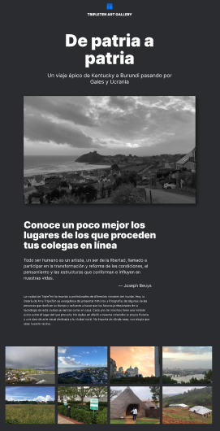

# Tripleten web_project_homeland

## Proyecto de diseño web adaptativo

Este proyecto fue realizado durante el bootcamp de desarrollo web de Tripleten. Utiliza HTML y CSS y está diseñado para ser responsivo, adaptándose a dispositivos desktop, tablet y mobile.

El diseño se llevó a cabo siguiendo un prototipo creado en Figma, lo que permitió mantener una estructura visual coherente y atractiva.

El proyecto fue desarrollado en Visual Studio Code (VSS).

### Previsualización del proyecto:

### Visita el proyecto

Puedes visualizar el proyecto en el siguiente enlace de GitHub Pages:
https://luis-gn006.github.io/web_project_homeland/index.html

#### Estructura del proyecto

- HTML: Se utiliza para estructurar el contenido del sitio, organizando secciones como introducción, galería y - lugares destacados.
- CSS: Se aplica para estilizar el contenido, asegurando que el diseño sea atractivo y responsivo.

# © Luis González
